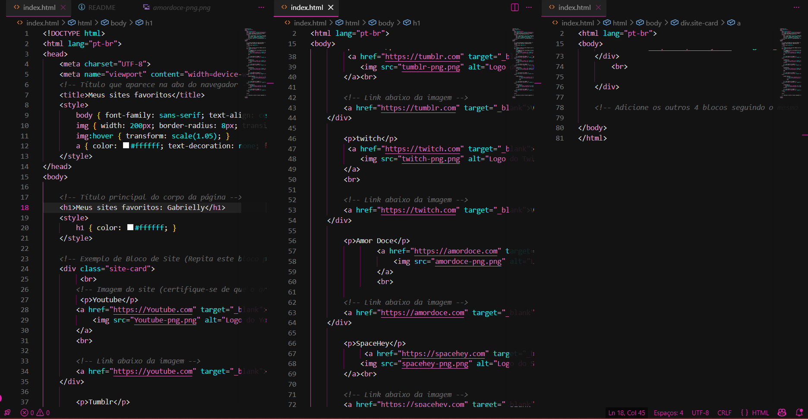
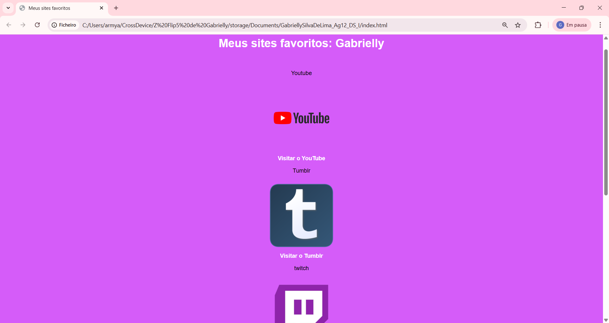
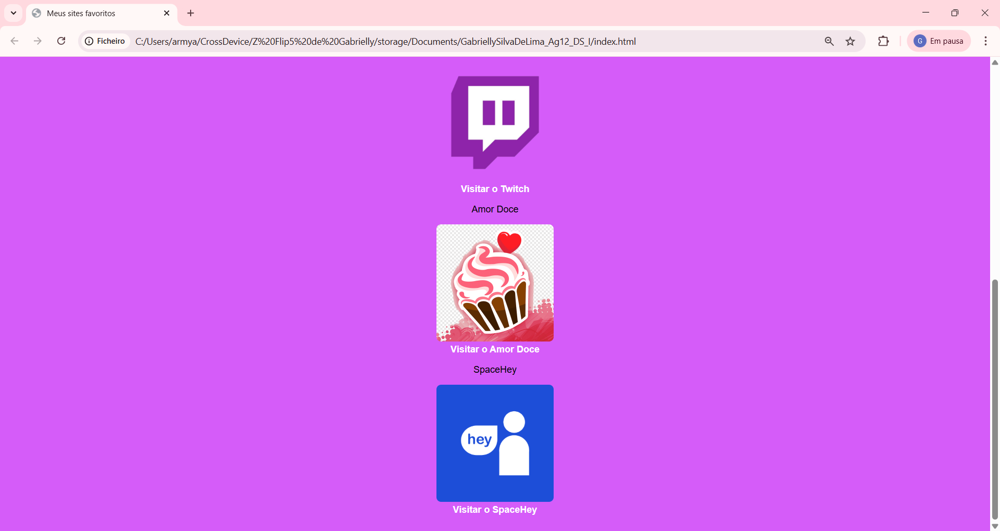

# 🌐 Projeto: Meus Sites Favoritos

Este repositório contém o código-fonte de uma página web simples desenvolvida para organizar e listar meus sites mais acessados. O projeto foi criado como parte das atividades práticas de Desenvolvimento Web, focando na estruturação de elementos HTML5.

## Tecnologias Utilizadas


## Funcionalidades

- Estrutura semântica em HTML.
- Listagem de 5 sites favoritos com nomes e links diretos.
- Galeria de imagens representativas de cada site.
- Navegação externa configurada para abrir em novas abas (`target="_blank"`).

## Estrutura do Repositório

- `index.html`: Arquivo principal com a marcação da página.
- `prints/`: Capturas de tela do código comentado e da página em execução (exigência da atividade).

## Demonstração





## Como visualizar o projeto

1. Clone o repositório:
   ```bash
   git clone [https://github.com/seu-usuario/meus-sites-favoritos.git](https://github.com/seu-usuario/meus-sites-favoritos.git)
